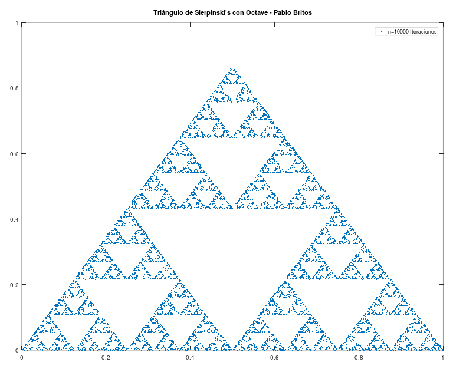

# El juego del caos

Alberto Rojo describe un juego interesante en su libro -El azar en la vida cotidiana- que consiste en dibujar un triángulo equilátero, elegir al azar un punto P dentro del triángulo, luego elegir al azar uno de los vértices. Luego marcar el punto medio entre P y el vértice elegido. El proceso se vuelve a repetir a partir del último punto marcado.

Para repetir muchas veces este proceso, es que realicé una simulación en matlab-octave.

Repitiendo este proceso 10000 veces pude obtener la siguiente figura, ¿asombroso, verdad?

